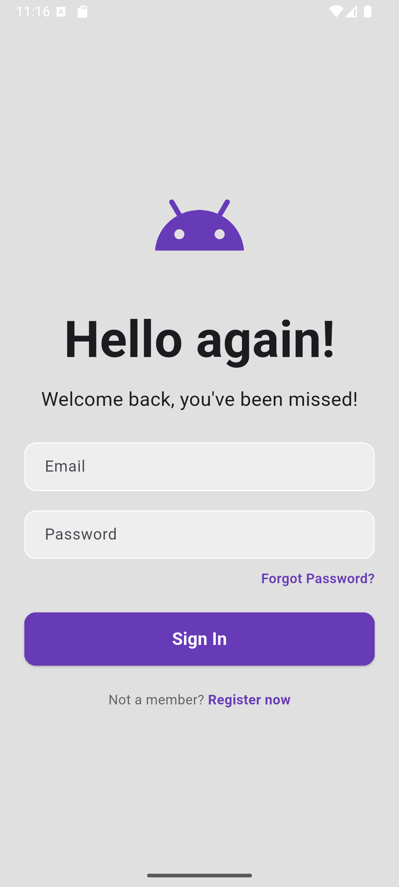

# Flutter Demo App (MVVM)

A Flutter application implementing **Firebase Email & Password Authentication**
using **MVVM architecture** with **Provider** for state management.

---
##  Features

- Firebase Email/Password Authentication
- Login Screen
- Register Screen
- Input Validation
- MVVM Architecture
- Provider State Management

##  Screenshots

###  Login Screen

###  Register Screen

---

##  Architecture

This project follows **MVVM (Model–View–ViewModel)**:

